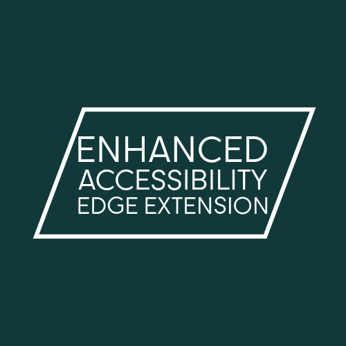

# Edge extension
An Edge extension experiment to help neurodivergent folk find zen interacting with web resources.

## Installation

This is still in very early development so it's not yet available in the Edge store. To install it, you'll need to sideload it.

To sideload, download the latest zip file from the releases folder in this repo.
Unzip the folder on your computer.
Open Edge and go to `edge://extensions/`.
Turn on developer mode.
Click "Load unpacked" and select the folder you just unzipped.

## Usage

Once installed, you can click on the extension icon to open the popup. The popup will show you a list of all the extensions you have installed, click on the eye icon to toggle the visibility of the extension on or off.

Once you have made it visible on your browser you should see the  icon in the top right of your browser. Clicking on this will open the extension popup.

On the popup there are some checkboxes to enable features of the extension. You can enable or disable any of these at any time. However if you disable either of the font changes it will refresh the tab you are on! 

At present the extension will not remember your settings between browser sessions or tabs. Add your voice to [this issue](https://github.com/Sam-Rowe/Edge-Accessibility-Enhancer-Extension/issues/1)

